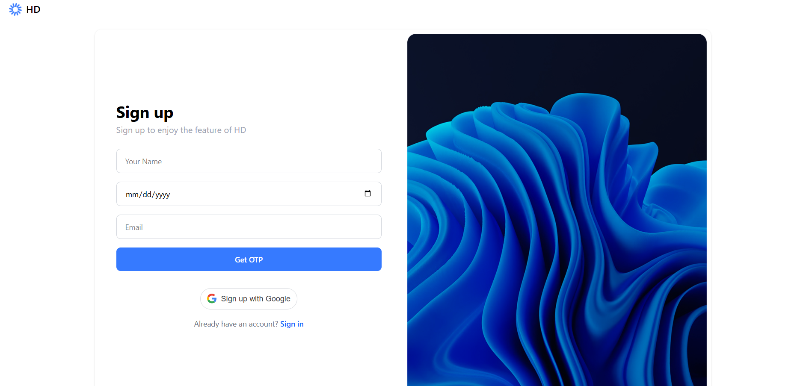
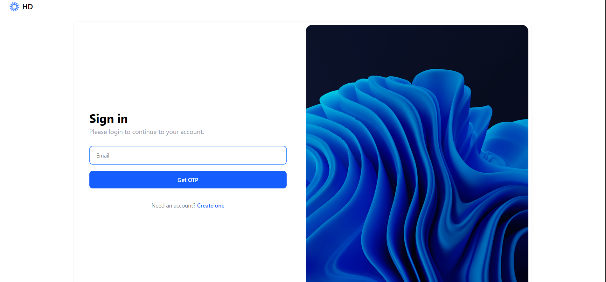
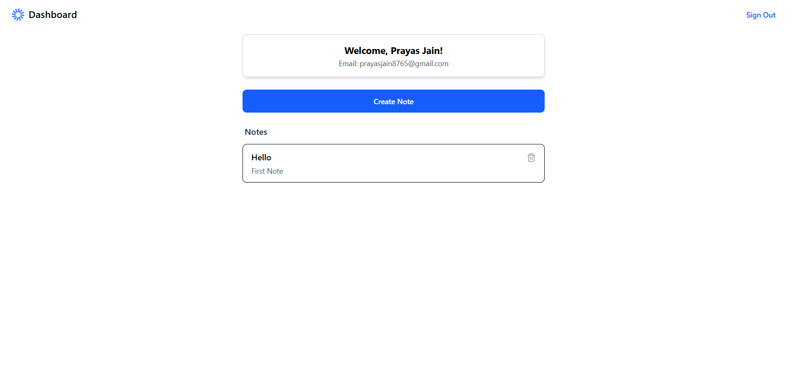

# 📝 NoteApp – Smart Note-Taking Web App


A modern, secure, and responsive note-taking web application built using **React.js + Node.js (TypeScript)**, featuring OTP-based authentication, Google sign-in, and a beautiful dashboard UI.

---

## 🔥 Features

✅ **User Authentication**
- Email + OTP Signup & Signin  
- Google OAuth Login  
- JWT-Based Secure Sessions

✅ **Dashboard**
- Personalized welcome message  
- Display of user notes with title & content  
- Mobile-first responsive design  

✅ **Note Management**
- Create, delete notes  
- All notes are securely linked to the authenticated user

✅ **Modern UI**
- Fully mobile-friendly  
- Styled using **Tailwind CSS**  
- Smooth transitions and form validation  
- Icons via `Lucide-React`

---

## 🖼️ Screenshots

### ✅ Signup Page  


### ✅ Signin Page  


### ✅ Dashboard  



---

## 🚀 Tech Stack

| Frontend        | Backend          | Other Integrations       |
|-----------------|------------------|---------------------------|
| React.js (Vite) | Node.js + Express (TypeScript) | Google OAuth via `@react-oauth/google` |
| React Hook Form | MongoDB via Mongoose | Nodemailer for email OTP |
| TailwindCSS     | JWT Auth & Middleware | React Toastify |

---

## ⚙️ Folder Structure

```
frontend/
├── src/
│   ├── components/       # Reusable UI
│   ├── pages/            # Routes: Signup, Signin, Dashboard
│   ├── services/         # API calls
│   ├── hooks/            # useAuth, useNotes
│   └── App.tsx, index.tsx
backend/
├── src/
│   ├── application/      # UseCases, DTOs, Services
│   ├── domain/           # Entities, Repositories
│   ├── infrastructure/   # MongoDB models
│   ├── interfaces/       # Controllers, Routes
│   ├── utils/            # Helpers, token utils
│   └── main.ts
```

---

## 🛠️ How to Run Locally

### 1. 📦 Clone the Repository
```bash
git clone https://github.com/prayasjain19/Note-App.git
cd notewise-app
```

### 2. ⚙️ Setup Backend

```bash
cd backend
npm install
cp .env.example .env
# Fill in your MongoDB URI, Email credentials, and Google Client ID
npm run dev
```

### 3. 💻 Setup Frontend

```bash
cd ../frontend
npm install
npm run dev
```

### 4. 🔐 Environment Variables

#### `.env` (Backend)
```env
PORT=5000
MONGO_URI=mongodb://localhost:27017/note_app
JWT_SECRET=your_jwt_secret
EMAIL_USER=your_email@gmail.com
EMAIL_PASS=your_email_app_password
GOOGLE_CLIENT_ID=xxxxx.apps.googleusercontent.com
```

#### `.env` (Frontend)
```env
VITE_GOOGLE_CLIENT_ID=xxxxx.apps.googleusercontent.com
```

---

## 🧪 API Overview

### Auth Routes

| Method | Route               | Description             |
|--------|---------------------|-------------------------|
| POST   | `/api/auth/signup`  | Request OTP             |
| POST   | `/api/auth/signin`  | Login via OTP           |
| POST   | `/api/auth/verify-otp` | Verify OTP & login  |
| POST   | `/api/auth/google-login` | Login via Google  |

### Note Routes (Protected)

| Method | Route               | Description             |
|--------|---------------------|-------------------------|
| GET    | `/api/notes`        | Get all notes           |
| POST   | `/api/notes`        | Create note             |
| DELETE | `/api/notes/:id`    | Delete note             |
| PUT    | `/api/notes/:id`    | Update note             |

---

## ✨ Credits

- UI Design: Figma Designs by Highway Delite (Assignment)
- Developed by: Prayas Jain
- React Icons: Lucide
- Toasts: React Toastify
- Email OTP: Nodemailer

---

## 📬 Contact

> 💼 Want to collaborate or have questions?

📧 **Email:** prayasjain8765@gmail.com  
🔗 **GitHub:** [github.com/prayasjain8765](https://github.com/prayasjain8765)

---

## 📄 License

This project is licensed under the **MIT License**.  
Feel free to use, modify, and share!